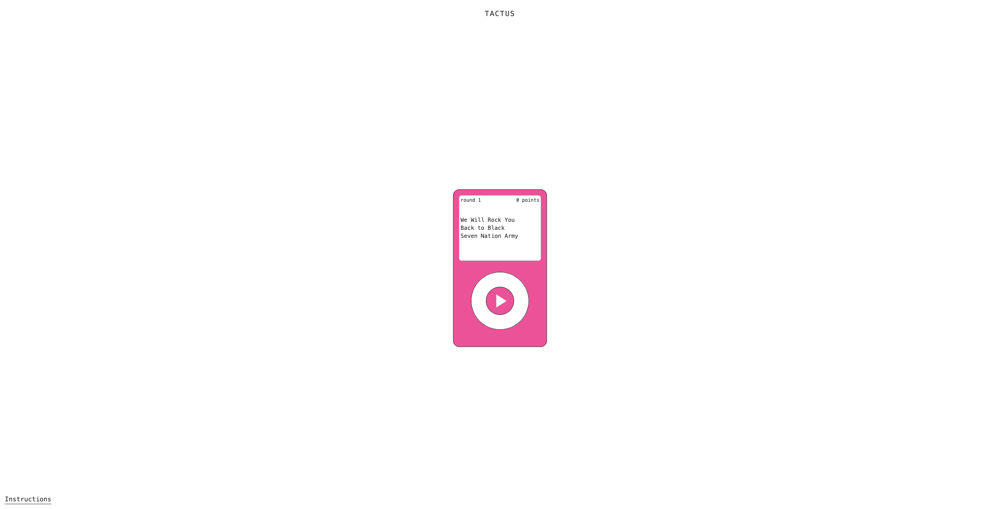

# Tactus

Web-based music recognition game where users identify songs through vibrotactile feedback alone — no sound, only touch. Tactus explores whether musical information can be conveyed through haptic sensations. Connect a Basslet wrist actuator and identify popular songs by feeling their distinctive rhythmic or melodic patterns translated into vibrations against your fingertip.




## The Concept
Popular songs are recognizable by their memorable motifs — short, distinctive patterns like the stomp-stomp-clap of "We Will Rock You" or the bass line from "Seven Nation Army".  For this project, I sourced audio versions containing only these key motifs and processed them in Audacity to optimize the vibration patterns for haptic feedback. Users feel these patterns through a Basslet actuator pressed against their fingertip, one of the body's most sensitive areas for vibrotactile detection.

## Setup & Installation
### Prerequisites

- Modern web browser
- Basslet wrist actuator
- Audio output capability

### Installation

1. Clone this repository
2. Install dependencies:
```
npm install
```
3. Run dev server:
```
npm run dev
```
4. Hardware setup
   - Connect Basslet actuator to your device's audio output
   - Place actuator against fingertip for optimal vibration detection
   - Ensure audio is enabled and volume is at maximum level

## Usage

1. Connect your Basslet actuator
2. Click "New Game" to start a 6-round session
3. Press the play button to feel the vibrotactile pattern (loops continuously)
4. Select the song from three multiple-choice options
